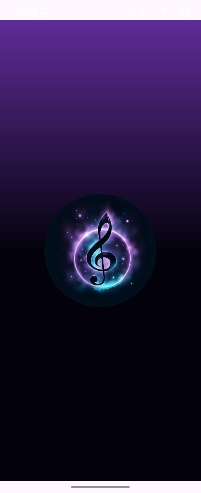
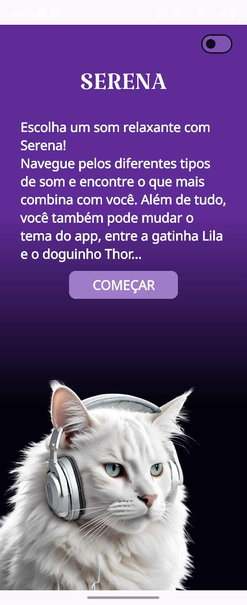
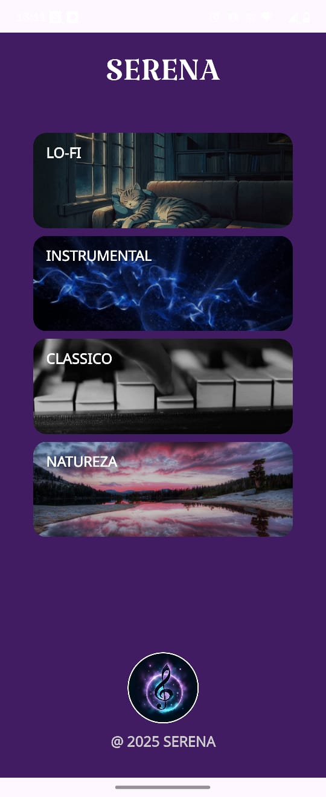
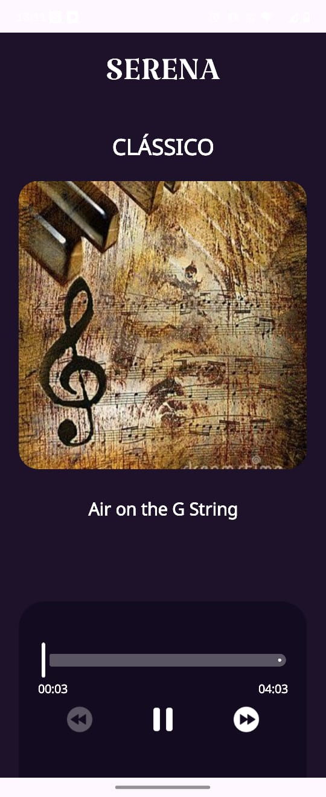

# 🎶 Serena

**Serena** é um refúgio sonoro em forma de app, construído com código, calma e muito carinho. 🧘‍♀️✨  
Se você sempre quis um lugar para encontrar a trilha sonora perfeita para focar, meditar ou simplesmente desligar do mundo... bom, eu também quis. E por isso, o **Serena** nasceu. 🎧

---

## ✨ O que o app faz?

✔️ Oferece um **player de áudio completo** com play/pause, avanço e retrocesso.

✔️ Permite explorar 4 categorias de sons para cada momento: **LO-FI, Instrumental, Clássico e Natureza**.

✔️ A música **continua tocando ao fundo**, mesmo se você voltar para a tela inicial.

✔️ Interface **100% Jetpack Compose**, com animações suaves.

✔️ Permite que você escolha seu **mascote** (gato ou cachorro 🐱🐶) para uma tela de boas-vindas personalizada.

✔️ Ao final de uma música, a próxima da lista **começa automaticamente**. Chega de interrupções!

---

## 🧠 Por trás do código

Antes de qualquer nota musical tocar, a arquitetura foi a minha partitura. O padrão **MVVM** foi essencial para criar um app organizado, onde a música (`Model`), a interface (`View`) e a lógica do player (`ViewModel`) vivem em perfeita harmonia.

Isso garante que o app seja estável, testável e, o mais importante, que sua música não pare de tocar inesperadamente.

Essa jornada foi uma imersão profunda em:

💡 UI moderna e reativa com **Jetpack Compose**.  
💡 Gerenciamento de estado com **StateFlow** para uma experiência fluida.  
💡 Arquitetura limpa para um código de fácil manutenção.  
💡 A música como o verdadeiro fio condutor da experiência do usuário.

---

## 🛠️ Tecnologias utilizadas

- **Linguagem:** Kotlin
- **UI:** Jetpack Compose & Material 3
- **Arquitetura:** MVVM (Model-View-ViewModel)
- **Estado e Assincronia:** `StateFlow` & Coroutines
- **Navegação:** Jetpack Navigation Compose
- **Player:** `MediaPlayer` nativo do Android
- **Imagens:** Coil (para os GIFs ✨)

---

## ✅ Resultado

Um app **funcional, elegante e relaxante** – um verdadeiro oásis de calma no seu celular.  
E o melhor? O resultado final ficou ainda mais sereno do que eu imaginei no começo. 🧘‍♀️

---

## 📱 Telas em Ação

> Veja como o Serena te transporta para um estado de calma! Interface limpa, sons envolventes e muito carinho em cada tela. ❤️

| Splash Screen | Tela de Boas-vindas | Tela Inicial | Player de Música |
| :-----------: | :------------------: | :------------: | :--------------: |
|  |  |  |  |

---

📸 Anexei abaixo o vídeo do app funcionando no celular.

## 🎥 Demonstração em vídeo

[](https://www.youtube.com/shorts/AzbX8FZG1TM)

> Veja como o Serena funciona na prática! Interface fluida, sons relaxantes e muito amor por trás de cada linha de código 💖

---

## 🚀 Quer testar?

Para executar este projeto, siga os passos abaixo:

1.  **Clone o repositório:**
    ```bash
    git clone [https://github.com/seu-usuario/serena.git](https://github.com/seu-usuario/serena.git) 
    ```
2.  **Abra no Android Studio** (versão Flamingo ou superior).
3.  **Sincronize o Gradle** e aguarde as dependências serem baixadas.
4.  **Execute o aplicativo** (▶️) em um emulador ou dispositivo físico.

---
## 🙏 Agradecimento especial


Quero agradecer ao meu professor **Gabriel Augusto Azevedo**, que com todo seu conhecimento e experiências compartilhadas me ajudou a evoluir e construir este aplicativo com ainda mais confiança. 💖

---
## ❤️ Feito por

Desenvolvido com muito carinho e código por **Naju**. ✨

---

## 💬 Pronto para relaxar?

...o **Serena** está esperando por você! 🎶💕
